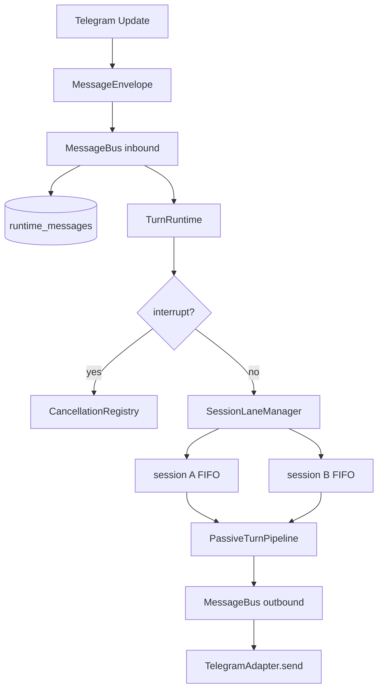

# M1 异步 Runtime 架构

M1 在原有五阶段 `PassiveTurnPipeline` 外增加异步运行时。Pipeline 仍负责“一轮
怎么思考”，Runtime 负责“多轮如何排队、并发、中断和可靠投递”。



## 责任边界

| 模块 | 责任 | 不负责 |
|---|---|---|
| `MessageEnvelope` | 跨渠道消息合同、优先级、幂等键 | 调度和业务处理 |
| `RuntimeMessageStore` | queued/running/终态、崩溃恢复 | Session聊天历史 |
| `MessageBus` | 入站/出站优先队列、持久准入、渠道分发 | LLM推理 |
| `SessionLaneManager` | 同Session FIFO、跨Session并发 | 消息持久化 |
| `CancellationRegistry` | 定位并取消Session当前Task | 重试和业务补偿 |
| `TurnRuntime` | 连接Bus、Lane和现有Pipeline | 重写ReAct Loop |

## 一条普通Telegram消息

```text
Telegram update_id=123
  → InboundMessage
  → MessageEnvelope(client_message_id="telegram:123")
  → runtime_messages: queued
  → MessageBus
  → telegram:chat_id:user_id 对应的Session Lane
  → runtime_messages: running
  → PassiveTurnPipeline五阶段
  → runtime_messages: done
  → Outbound Envelope
  → MessageBus outbound
  → TelegramAdapter.send()
```

同一个 `session_key` 只有一个活跃Turn，因此Session历史不会被同会话的两轮同时
修改。不同 `session_key` 各自拥有Worker，所以慢工具不会阻塞其他用户。

## 中断传播

`/stop` 使用 `INTERRUPT` 优先级，不进入Session FIFO等待：

```text
/stop → TurnRuntime control path → CancellationRegistry
      → asyncio.Task.cancel()
      → LLM await / Tool await收到CancelledError
      → Pipeline Trace=cancelled
      → runtime_messages=cancelled
      → 旧答案不进入outbound queue
```

Telegram普通新消息带 `preempt_active=true`，也会先取消该Session旧Turn，再按FIFO
执行新Turn。工具自己的超时仍由 `ToolRuntime` 控制，两层机制互不替代。

## 重启与幂等

`runtime_messages.dedupe_key` 对Telegram固定为：

```text
session_key + ":telegram:" + update_id
```

相同Update再次到达时无法重复准入。启动恢复只加载 `queued/running` 入站消息，
`done/failed/cancelled` 都是终态，不会再次消费。

## M1没有做什么

- 没有把 `Reasoner.run_turn()` 的ReAct算法复制到新类，只由TurnRuntime包裹调用。
- 没有实现M2的五级上下文降级，`context_budget.py` 留到M2。
- 没有实现分布式多进程Worker；当前Session Lane是单进程asyncio调度器。
