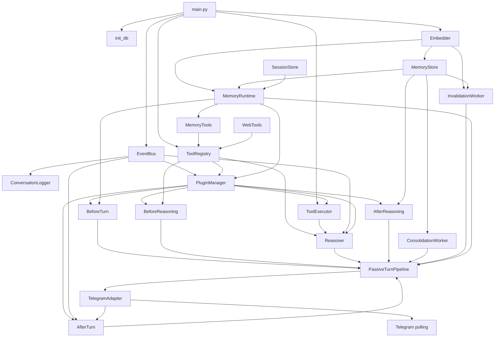

# `main.py` 启动依赖图

这张图冻结 M0 时刻的生产启动链。箭头表示“创建者把依赖注入给使用者”，不是运行时事件流。

> 这是M0历史基线。M1后的生产消息入口已经改为MessageBus和Session Lane，当前结构见
> [`m1_async_runtime.md`](m1_async_runtime.md)。

## 创建顺序

1. 初始化 SQLite 与 sqlite-vec。
2. 创建 Embedder、MemoryStore、SessionStore 和 MemoryRuntime。
3. 获取全局 EventBus，创建 ToolRegistry 与 ToolExecutor。
4. 启动 ConversationLogger。
5. 创建 Reasoner，注册内置 Memory/Web 工具。
6. 加载插件并注入 Tool Hooks 与 Step Modules。
7. 创建五阶段 Pipeline 组件。
8. 创建 ConsolidationWorker 与 InvalidationWorker。
9. 组装 PassiveTurnPipeline。
10. 创建 TelegramAdapter，反向注入 AfterTurnPhase。
11. 启动 Telegram polling，并由主协程保持运行。

## 关闭顺序

程序收到取消或 `KeyboardInterrupt` 后，终止插件进程并刷新 ConversationLogger。Telegram Adapter 自身的停止流程由运行入口/调用方负责。
